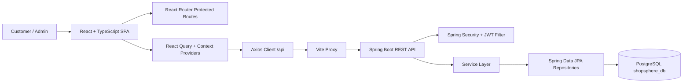
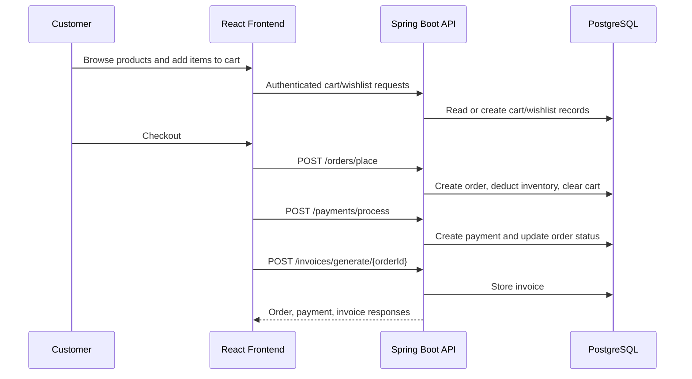

# 🛒 ShopSphere

### A full-stack e-commerce platform with a modern React storefront and a secure Spring Boot commerce API.

ShopSphere combines a customer shopping experience, role-based admin tools, PostgreSQL-backed inventory, order processing, payments, invoices, notifications, and reporting into one cohesive application. The project is built as a Vite + React frontend with a Java 21 Spring Boot backend and SQL scripts for local database setup.


[](https://github.com/Ramya-Ramadoss/shopsphere/stargazers)
[](https://github.com/Ramya-Ramadoss/shopsphere/forks)
[](https://github.com/Ramya-Ramadoss/shopsphere/issues)
[](https://github.com/Ramya-Ramadoss/shopsphere/commits/main)


### 🌐 Live Demo &nbsp; | &nbsp; 📖 Documentation &nbsp; | &nbsp; 🎥 Demo Video &nbsp; | &nbsp; 📦 Repository

**🌐 Live Demo:** [Add Deployment Link Here](https://your-live-demo-link.com)  
**📖 Documentation:** [Add Documentation Link Here](https://your-docs-link.com)  
**🎥 Demo Video:** [Add Demo Video Link Here](https://youtube.com/...)  
**📦 Repository:** [github.com/Ramya-Ramadoss/shopsphere](https://github.com/Ramya-Ramadoss/shopsphere)


> *Replace this with your project banner or hero image.*

---

## 📚 Table Of Contents

- [Project Overview](#-project-overview)
- [Features](#-features)
- [Tech Stack](#-tech-stack)
- [Project Architecture](#-project-architecture)
- [Screenshots](#-screenshots)
- [Live Demo](#-live-demo)
- [Installation](#-installation)
- [Usage](#-usage)
- [Folder Structure](#-folder-structure)
- [Configuration](#-configuration)
- [API Documentation](#-api-documentation)
- [Machine Learning / AI](#-machine-learning--ai)
- [Performance](#-performance)
- [Security](#-security)
- [Roadmap](#-roadmap)
- [Future Enhancements](#-future-enhancements)
- [Contributing](#-contributing)
- [License](#-license)
- [Author](#-author)
- [Acknowledgements](#-acknowledgements)
- [Support](#-support)

---

## 🔎 Project Overview

ShopSphere is a full-stack e-commerce application for browsing products, managing customer carts and wishlists, placing orders, processing payments, generating invoices, and running admin operations from a dedicated dashboard.

The project solves the core workflow of an online store:

| Area | What ShopSphere Provides |
| --- | --- |
| Customers | Product discovery, search, filtering, product detail pages, cart, wishlist, checkout, payment, order history, invoices, profile management, notifications, recently viewed products |
| Admins | Dashboard metrics, product and category management, order status controls, inventory updates, low-stock visibility, reports |
| Backend | JWT authentication, role-based authorization, Spring Data JPA persistence, validation, exception handling, OpenAPI-ready REST endpoints |
| Database | PostgreSQL schema scripts, indexes, validation queries, test queries, and sample catalog/order data |

> [!NOTE]
> Live deployment, external documentation, and demo video links are not present in the repository yet, so this README keeps them as placeholders.

---

## ✨ Features

### 🛍️ Core Features

- Product catalog with categories, brands, prices, images, ratings, and inventory status.
- Product search and filtered pagination by name, category, brand, price range, availability, page, size, and sort.
- Customer registration and JWT login.
- Customer cart with add, update quantity, remove item, and clear cart workflows.
- Wishlist with add, remove, and move-to-cart support.
- Checkout flow that places orders from cart items and clears the cart after order creation.
- Payment processing with generated transaction IDs and status handling.
- Invoice generation, lookup, and downloadable invoice text.
- Order history and order cancellation for customers.
- Recently viewed products per customer.
- Customer notifications for order, payment, delivery, cancellation, and stock events.

### 🤖 AI Features

- No machine learning or AI inference pipeline is implemented in the current codebase.

### 🎨 UI/UX Features

- React 19 + TypeScript single-page application.
- Public customer storefront and protected customer account screens.
- Protected admin layout for operational pages.
- Toast notifications with `react-hot-toast`.
- Animated UI capabilities through `framer-motion`.
- Chart-ready reporting UI using `recharts`.
- Theme context for app-wide theme state.
- Custom 404 route.

### 🔐 Security Features

- Spring Security with stateless JWT authentication.
- BCrypt password encoder.
- Role-aware frontend route protection for `CUSTOMER` and `ADMIN`.
- Backend role authorization for admin inventory, reports, dashboards, product mutations, and category mutations.
- CORS configuration for local React origins.
- Request validation with Jakarta Validation.
- Centralized exception handling and consistent API response wrapping.

### ⚡ Performance Features

- Vite development server and optimized production build.
- React Query cache defaults with five-minute `staleTime`, one retry, and disabled refetch on window focus.
- PostgreSQL index script for commonly queried fields across products, orders, customers, payments, notifications, and recently viewed records.
- Paginated product filtering endpoint.
- Docker multi-stage backend build.

### 🧰 Developer Features

- Separate frontend and backend projects for clear ownership.
- Maven wrapper for backend builds.
- Dockerfile and Docker Compose for backend + PostgreSQL.
- SQL scripts for database creation, schema setup, seed data, indexes, validation queries, and test queries.
- OpenAPI/Swagger dependency included through `springdoc-openapi`.
- Unit tests for order service, payment service, JWT provider, and Spring context.
- ESLint configuration for the frontend.

---

## 🧱 Tech Stack

| Layer | Technologies |
| --- | --- |
| Frontend | React 19.2.6, TypeScript 6.0.2, Vite 8.0.12 |
| Routing | React Router DOM 7.18.0 |
| Server State | TanStack React Query 5.101.0 |
| Forms & Validation | React Hook Form, Zod, `@hookform/resolvers` |
| UI Libraries | Lucide React, Framer Motion, React Hot Toast, Recharts |
| Styling | CSS, Tailwind CSS 4.3.1 via `@tailwindcss/vite` |
| Backend | Java 21, Spring Boot 3.5.3, Spring Web |
| Security | Spring Security, JWT via `jjwt`, BCrypt |
| Database | PostgreSQL, Spring Data JPA, Hibernate |
| Mapping | MapStruct, Lombok |
| API Docs | Springdoc OpenAPI / Swagger UI |
| Testing | JUnit 5, Mockito, Spring Boot Test, Spring Security Test |
| Deployment | Dockerfile, Docker Compose |
| Dev Tools | Maven Wrapper, ESLint, Vite proxy |

---

## 🏗️ Project Architecture



### Application Workflow



<details>
<summary><strong>📁 Architecture Notes</strong></summary>

- The frontend API client uses `/api` as its base URL.
- Vite proxies `/api` to `http://localhost:8080` and strips the `/api` prefix before forwarding to Spring Boot.
- The backend exposes REST controllers under paths such as `/auth`, `/products`, `/cart`, `/orders`, and `/reports`.
- The backend uses DTOs, mappers, services, repositories, and entities to keep request/response models separate from persistence models.
- Cart and wishlist services use a get-or-create pattern so newly registered customers can use these features without pre-created records.

</details>

---

## 📸 Screenshots

> Add your screenshots here.

### Home Page


### Product Listing


### Product Details


### Wishlist


### Cart


### Checkout


### Payment


### Order History


### Profile


### Admin Dashboard


### Admin Products


### Admin Categories


### Admin Orders


### Admin Inventory


### Admin Reports


---

## 🌐 Live Demo

- 🌐 Live Demo: **[Add Deployment Link Here]**
- 🎥 Demo Video: **[Add YouTube Link Here]**
- 📄 Documentation: **[Add Docs Link Here]**

---

## ⚙️ Installation

### Prerequisites

| Tool | Required For |
| --- | --- |
| Node.js + npm | Frontend development and builds |
| Java 21 | Spring Boot backend |
| PostgreSQL | Local database |
| Maven Wrapper | Included in `shopsphere/` |
| Docker | Optional backend + database container workflow |

### 1. Clone The Repository

```bash
git clone https://github.com/Ramya-Ramadoss/shopsphere.git
cd shopsphere
```

### 2. Install Frontend Dependencies

```bash
npm install
```

### 3. Set Up PostgreSQL

Create the database:

```bash
psql -U postgres -f database/create_database.sql
```

Create tables:

```bash
psql -U postgres -d shopsphere_db -f database/create_tables.sql
```

Add indexes:

```bash
psql -U postgres -d shopsphere_db -f database/indexes.sql
```

Seed sample data:

```bash
psql -U postgres -d shopsphere_db -f database/sample_data.sql
```

### 4. Configure Backend Settings

Update `shopsphere/src/main/resources/application.properties` if your local PostgreSQL credentials differ:

```properties
spring.datasource.url=jdbc:postgresql://localhost:5432/shopsphere_db
spring.datasource.username=postgres
spring.datasource.password=student123
jwt.secret=replace-with-a-secure-secret
jwt.expiration=86400000
```

> [!IMPORTANT]
> The repository currently contains development defaults in `application.properties`. For production, move database passwords and JWT secrets to environment variables or a secure secret manager.

### 5. Run The Backend

From the backend directory:

```bash
cd shopsphere
./mvnw spring-boot:run
```

On Windows PowerShell:

```powershell
cd shopsphere
.\mvnw.cmd spring-boot:run
```

Backend runs at:

```text
http://localhost:8080
```

Swagger UI should be available when the backend is running:

```text
http://localhost:8080/swagger-ui.html
```

### 6. Run The Frontend

From the repository root:

```bash
npm run dev
```

Frontend runs at:

```text
http://localhost:5173
```

### 7. Build For Production

Frontend:

```bash
npm run build
```

Backend:

```bash
cd shopsphere
./mvnw clean package
```

### 8. Optional Docker Backend Workflow

From `shopsphere/`:

```bash
docker compose up --build
```

This starts:

| Service | Port |
| --- | --- |
| Spring Boot backend | `8080` |
| PostgreSQL | `5432` |

---

## 🧭 Usage

### Customer Workflow

1. Open `http://localhost:5173`.
2. Browse products from the home page or product listing page.
3. Use filters for category, brand, price, and availability.
4. Open a product details page to view images, stock, ratings, and reviews.
5. Register or log in as a customer.
6. Add products to cart or wishlist.
7. Move wishlist items to cart when ready.
8. Checkout, provide shipping details, and place an order.
9. Process payment.
10. View order success, invoice, and order history.

### Admin Workflow

1. Log in with an admin account.
2. Visit `/admin/dashboard`.
3. Manage products and categories.
4. Track orders and update order status.
5. Review inventory and low-stock items.
6. Open reports for revenue, inventory, category sales, top products, and top customers.

<details>
<summary><strong>🔑 Sample Credentials</strong></summary>

The current SQL seed file contains sample users, but their passwords are stored as placeholder hashes rather than BCrypt-ready login credentials.

The existing run documentation mentions:

| Role | Email | Password |
| --- | --- | --- |
| Admin | `admin@shopsphere.com` | `Admin@123` |
| Customer | `customer1@shopsphere.com` | `Password@123` |

If these accounts are not present in your local database, create users through the app or insert BCrypt-encoded credentials that match the backend authentication flow.

</details>

---

## 🗂️ Folder Structure

```text
ShopSphere/
├── database/
│   ├── create_database.sql
│   ├── create_tables.sql
│   ├── indexes.sql
│   ├── sample_data.sql
│   ├── test_queries.sql
│   └── validation_queries.sql
├── public/
│   ├── favicon.svg
│   └── icons.svg
├── src/
│   ├── assets/
│   ├── components/
│   │   ├── cards/
│   │   ├── common/
│   │   └── layout/
│   ├── context/
│   ├── pages/
│   │   ├── admin/
│   │   ├── auth/
│   │   ├── cart/
│   │   ├── customer/
│   │   ├── inventory/
│   │   ├── orders/
│   │   ├── profile/
│   │   ├── reports/
│   │   └── wishlist/
│   ├── routes/
│   ├── services/
│   ├── types/
│   ├── App.tsx
│   ├── index.css
│   └── main.tsx
├── shopsphere/
│   ├── src/main/java/com/shopsphere/
│   │   ├── config/
│   │   ├── controller/
│   │   ├── dto/
│   │   ├── entity/
│   │   ├── enums/
│   │   ├── exception/
│   │   ├── mapper/
│   │   ├── repository/
│   │   ├── security/
│   │   ├── service/
│   │   ├── serviceImpl/
│   │   ├── util/
│   │   └── ShopsphereApplication.java
│   ├── src/main/resources/
│   │   ├── application.properties
│   │   └── logback-spring.xml
│   ├── src/test/java/com/shopsphere/
│   ├── Dockerfile
│   ├── docker-compose.yml
│   ├── mvnw
│   ├── mvnw.cmd
│   └── pom.xml
├── eslint.config.js
├── package.json
├── tsconfig.app.json
├── tsconfig.json
├── tsconfig.node.json
└── vite.config.ts
```

---

## 🔧 Configuration

### Frontend

| File | Purpose |
| --- | --- |
| `vite.config.ts` | React + Tailwind Vite plugins and `/api` proxy to backend |
| `src/services/axios.ts` | Axios client, JWT header injection, response mapping, global error handling |
| `src/context/AuthContext.tsx` | Auth state, localStorage persistence, logout callback |
| `src/context/CartContext.tsx` | Cart queries and mutations |
| `src/context/WishlistContext.tsx` | Wishlist queries and mutations |

The frontend uses:

```text
API base URL: /api
Vite proxy target: http://localhost:8080
```

### Backend

| Property | Current Development Value |
| --- | --- |
| `spring.datasource.url` | `jdbc:postgresql://localhost:5432/shopsphere_db` |
| `spring.datasource.username` | `postgres` |
| `spring.datasource.password` | `student123` |
| `spring.jpa.hibernate.ddl-auto` | `update` |
| `jwt.secret` | Development secret in `application.properties` |
| `jwt.expiration` | `86400000` ms |

### Environment Variables

Docker Compose defines these backend environment values:

| Variable | Purpose |
| --- | --- |
| `SPRING_DATASOURCE_URL` | PostgreSQL JDBC URL for containerized backend |
| `SPRING_DATASOURCE_USERNAME` | Database username |
| `SPRING_DATASOURCE_PASSWORD` | Database password |
| `JWT_SECRET` | JWT signing secret |
| `JWT_EXPIRATION` | Token lifetime |

> [!WARNING]
> The current `application.properties` does not reference `${JWT_SECRET}` or datasource environment placeholders directly. If you want environment-first configuration outside Docker, update the Spring properties accordingly.

---

## 📡 API Documentation

Base URL in local backend:

```text
http://localhost:8080
```

Frontend requests go through:

```text
/api
```

### API Surface

| Method | Endpoint | Description | Parameters / Body | Response |
| --- | --- | --- | --- | --- |
| `POST` | `/auth/login` | Authenticate a user | `LoginRequest` | `AuthResponse` with JWT and user data |
| `POST` | `/customers/register` | Register customer | `CustomerRequest` | `CustomerResponse` |
| `GET` | `/customers` | List customers | Authenticated | `CustomerResponse[]` |
| `GET` | `/customers/{id}` | Get customer profile | `id` path param | `CustomerResponse` |
| `PUT` | `/customers/{id}` | Update customer | `id`, `CustomerRequest` | `CustomerResponse` |
| `DELETE` | `/customers/{id}` | Delete customer | `id` path param | `204 No Content` |
| `GET` | `/products` | List products | Public | `ProductResponse[]` |
| `POST` | `/products` | Create product | Admin, `ProductRequest` | `ProductResponse` |
| `GET` | `/products/{id}` | Get product | Public, `id` | `ProductResponse` |
| `PUT` | `/products/{id}` | Update product | Admin, `id`, `ProductRequest` | `ProductResponse` |
| `DELETE` | `/products/{id}` | Delete product | Admin, `id` | `204 No Content` |
| `GET` | `/products/search` | Search products | `query` | `ProductResponse[]` |
| `GET` | `/products/filter` | Filter and paginate products | `name`, `categoryId`, `brand`, `minPrice`, `maxPrice`, `available`, `page`, `size`, `sort` | Page of `ProductResponse` |
| `GET` | `/categories` | List categories | Public | `CategoryResponse[]` |
| `POST` | `/categories` | Create category | Admin, `CategoryRequest` | `CategoryResponse` |
| `GET` | `/categories/{id}` | Get category | Public, `id` | `CategoryResponse` |
| `PUT` | `/categories/{id}` | Update category | Admin, `id`, `CategoryRequest` | `CategoryResponse` |
| `DELETE` | `/categories/{id}` | Delete category | Admin, `id` | `204 No Content` |
| `GET` | `/cart/{customerId}` | Get or create customer cart | `customerId` | `CartResponse` |
| `POST` | `/cart/add` | Add item to cart | `CartRequest` | `CartResponse` |
| `PUT` | `/cart/update` | Update cart quantity | `CartRequest` | `CartResponse` |
| `DELETE` | `/cart/remove/{cartItemId}` | Remove cart item | `cartItemId` | `204 No Content` |
| `DELETE` | `/cart/clear/{customerId}` | Clear customer cart | `customerId` | `204 No Content` |
| `GET` | `/wishlist/{customerId}` | Get or create wishlist | `customerId` | `WishlistResponse` |
| `POST` | `/wishlist/add` | Add wishlist item | `WishlistRequest` | `WishlistResponse` |
| `DELETE` | `/wishlist/remove/{wishlistItemId}` | Remove wishlist item | `wishlistItemId` | `204 No Content` |
| `POST` | `/wishlist/move-to-cart` | Move wishlist product to cart | `WishlistRequest` | `204/OK` |
| `POST` | `/orders/place` | Place order from cart | `OrderRequest` | `OrderResponse` |
| `GET` | `/orders` | List all orders | Authenticated | `OrderResponse[]` |
| `GET` | `/orders/{id}` | Get order by ID | `id` | `OrderResponse` |
| `GET` | `/orders/customer/{customerId}` | List customer orders | `customerId` | `OrderResponse[]` |
| `PUT` | `/orders/cancel/{id}` | Cancel order | `id` | `204 No Content` |
| `PUT` | `/orders/update-status/{id}` | Update order status | `id`, `status` query param | `OrderResponse` |
| `POST` | `/payments/process` | Process payment | `PaymentRequest` | `PaymentResponse` |
| `GET` | `/payments/order/{orderId}` | Get payment by order | `orderId` | `PaymentResponse` |
| `POST` | `/invoices/generate/{orderId}` | Generate invoice | `orderId` | `InvoiceResponse` |
| `GET` | `/invoices/order/{orderId}` | Get invoice by order | `orderId` | `InvoiceResponse` |
| `GET` | `/invoices/{id}` | Get invoice by ID | `id` | `InvoiceResponse` |
| `GET` | `/invoices/download/{id}` | Download invoice | `id` | Text/file response |
| `GET` | `/notifications/customer/{customerId}` | List customer notifications | `customerId` | `NotificationResponse[]` |
| `PUT` | `/notifications/read/{id}` | Mark notification read | `id` | `NotificationResponse` |
| `DELETE` | `/notifications/{id}` | Delete notification | `id` | `204 No Content` |
| `GET` | `/notifications/unread-count/{customerId}` | Count unread notifications | `customerId` | Count response |
| `GET` | `/inventory` | List inventory | Admin | `InventoryResponse[]` |
| `PUT` | `/inventory/update` | Update inventory | Admin, `InventoryRequest` | `InventoryResponse` |
| `GET` | `/inventory/low-stock` | List low-stock items | Admin | `InventoryResponse[]` |
| `GET` | `/dashboard/customer/{customerId}` | Customer dashboard data | `customerId` | `CustomerDashboardResponse` |
| `GET` | `/dashboard/admin` | Admin dashboard data | Admin | `AdminDashboardResponse` |
| `GET` | `/reports/revenue` | Revenue report | Admin | `Map<String,Object>` |
| `GET` | `/reports/sales` | Sales report | Admin | `Map<String,Object>` |
| `GET` | `/reports/inventory` | Inventory report | Admin | `Map<String,Object>` |
| `GET` | `/reports/category-sales` | Category sales report | Admin | `Map<String,Object>` |
| `GET` | `/reports/monthly-orders` | Monthly order report | Admin | `Map<String,Object>` |
| `GET` | `/reports/customer-stats` | Customer statistics | Admin | `Map<String,Object>` |
| `GET` | `/reports/top-selling` | Top-selling products | Admin | `Map<String,Object>` |
| `GET` | `/reports/top-customers` | Top customers | Admin | `Map<String,Object>` |
| `POST` | `/reviews` | Create product review | `ReviewRequest` | `ReviewResponse` |
| `GET` | `/reviews/product/{productId}` | List product reviews | `productId` | `ReviewResponse[]` |
| `PUT` | `/reviews/{id}` | Update review | `id`, `ReviewRequest` | `ReviewResponse` |
| `DELETE` | `/reviews/{id}` | Delete review | `id` | `204 No Content` |
| `POST` | `/recently-viewed` | Add recently viewed product | `RecentlyViewedRequest` | `RecentlyViewedResponse` |
| `GET` | `/recently-viewed/{customerId}` | List recently viewed products | `customerId` | `RecentlyViewedResponse[]` |
| `DELETE` | `/recently-viewed/{customerId}` | Clear recently viewed products | `customerId` | `204 No Content` |

---

## 🧠 Machine Learning / AI

ShopSphere does not currently include:

- ML models.
- Dataset training scripts.
- Model evaluation metrics.
- Inference services.
- AI recommendation logic.

Future recommendation, personalization, search-ranking, or demand forecasting features would fit naturally into the product, reporting, and inventory domains.

---

## 🚀 Performance

- Product filtering is implemented through a backend paginated endpoint.
- React Query reduces repeated network requests and caches customer-specific cart/wishlist data.
- Vite keeps the frontend development workflow fast.
- PostgreSQL indexes are defined for high-use columns such as product name, brand, category, price, rating, order status, order date, payment status, and notification read state.
- Backend Dockerfile uses a multi-stage build to keep the runtime image focused on the generated JAR.
- Inventory updates and cart clearing are handled transactionally during order placement.

---

## 🔒 Security

ShopSphere implements:

- JWT authentication with a custom token provider and authentication filter.
- Stateless Spring Security sessions.
- BCrypt password encoding.
- Backend role authorization for admin-only resources.
- Frontend protected routes for customer and admin experiences.
- CORS allowlist for `http://localhost:5173` and `http://localhost:3000`.
- Validation annotations on request DTOs.
- Centralized error responses through global exception handling.

Recommended production hardening:

- Move secrets out of source-controlled properties.
- Add refresh tokens or token rotation.
- Add rate limiting for auth endpoints.
- Use HTTPS-only cookies or carefully reviewed token storage.
- Tighten CORS origins to deployed domains only.
- Add audit logging for admin mutations.

---

## 🗺️ Roadmap

- [x] React storefront
- [x] Product listing and filtering
- [x] Product details page
- [x] JWT login
- [x] Customer registration
- [x] Cart management
- [x] Wishlist management
- [x] Checkout and order placement
- [x] Payment processing
- [x] Invoice generation and download
- [x] Customer notifications
- [x] Admin dashboard
- [x] Product/category administration
- [x] Inventory management
- [x] Reporting endpoints
- [x] PostgreSQL SQL setup scripts
- [x] Docker backend setup
- [ ] Production environment variable configuration
- [ ] Complete deployment pipeline
- [ ] Add real screenshots and banner
- [ ] Add user-facing documentation site
- [ ] Add end-to-end tests
- [ ] Add payment gateway integration
- [ ] Add email notifications
- [ ] Add product image upload storage

---

## 🔮 Future Enhancements

- Real payment provider integration such as Razorpay, Stripe, or PayPal.
- Cloud object storage for product images.
- Email/SMS notifications for order lifecycle events.
- Admin audit trail.
- Coupons, discounts, and promotion engine.
- Product recommendations based on recently viewed and order history.
- Advanced search with full-text indexing.
- Docker Compose profile for frontend + backend + database.
- CI pipeline for lint, frontend build, backend tests, and Docker image validation.
- Production-ready secrets management.

---

## 🤝 Contributing

Contributions are welcome once the project owner opens the workflow for public collaboration.

1. Fork the repository.
2. Create a feature branch:

```bash
git checkout -b feature/your-feature-name
```

3. Commit your changes:

```bash
git commit -m "feat: add your feature"
```

4. Push to your branch:

```bash
git push origin feature/your-feature-name
```

5. Open a pull request with:

- Clear summary.
- Screenshots for UI changes.
- Test results.
- Notes for database or configuration changes.

---

## 📄 License

License information is not currently included in the repository.

**Placeholder:** Add a `LICENSE` file and update this section with the selected license.

---

## 👤 Author

| Field | Details |
| --- | --- |
| Name | Add Author Name |
| GitHub | [Add GitHub Profile](https://github.com/) |
| LinkedIn | [Add LinkedIn Profile](https://linkedin.com/) |
| Portfolio | [Add Portfolio Link](https://your-portfolio-link.com) |
| Email | `your.email@example.com` |

---

## 🙏 Acknowledgements

ShopSphere uses and acknowledges:

- React, Vite, and TypeScript for the frontend foundation.
- Spring Boot, Spring Security, and Spring Data JPA for backend architecture.
- PostgreSQL for relational persistence.
- TanStack React Query for server-state management.
- React Hook Form and Zod for form workflows.
- Recharts for analytics visualizations.
- MapStruct and Lombok for backend productivity.
- Springdoc OpenAPI for API documentation support.

---

## 💬 Support

- Issues: [GitHub Issues](https://github.com/Ramya-Ramadoss/shopsphere/issues)
- Discussions: **[Add Discussions Link Here]**
- Email: `your.email@example.com`
- Donations: **[Optional Donation Link Here]**

---

### ⭐ If you found this project useful, please consider giving it a star!

Built with React, Spring Boot, PostgreSQL, and a lot of commerce workflow wiring.
