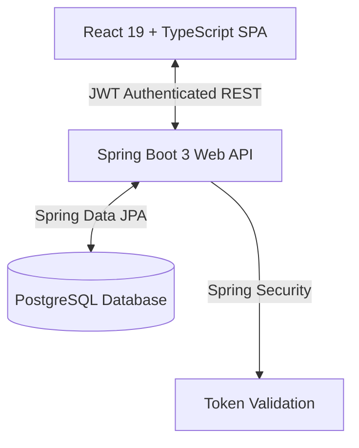

# 🛒 ShopSphere - Enterprise-Grade Full-Stack E-Commerce Platform

ShopSphere is a robust, production-ready, full-stack e-commerce web application featuring a modern **React 19** frontend and a secure **Spring Boot 3** REST API backend. It is designed with clean architecture principles, featuring role-based dashboards, self-healing database repositories, real-time inventory checks, and JWT-authenticated session states.

---

## 🎨 Application Screenshots

<table>
  <tr>
    <td width="50%">
      <p align="center"><b>🛍️ Customer Storefront & Product Specs</b></p>
      <!-- ADD IMAGE HERE (e.g. ) -->
      <p align="center">[Placeholder: Add Product Details/Storefront Screenshot]</p>
    </td>
    <td width="50%">
      <p align="center"><b>📊 Admin Catalog & Dashboard Analytics</b></p>
      <!-- ADD IMAGE HERE (e.g. ) -->
      <p align="center">[Placeholder: Add Admin Dashboard/Products List Screenshot]</p>
    </td>
  </tr>
</table>

---

## 🚀 Key Features

### 👤 Customer Experience
* **Interactive Storefront**: Filterable and searchable product listings by brand, category, price range, and availability.
* **Product Details**: Dedicated spec sheets, averaging star reviews, and stock quantity tracking.
* **Dynamic Wishlist**: Add/remove products and instantly transfer them to the shopping cart.
* **Active Shopping Cart**: Manage quantities directly with automatic price calculations.
* **Secure Checkout**: Full shipping address collection and direct order creation with auto-deducting inventory levels.
* **Recently Viewed Carousel**: Client-side browsing history synced with profile states.

### 🔑 Administrator Controls
* **Performance Dashboard**: Real-time sales stats (Total Revenue, Order counts, low-stock warnings, and top-selling catalogs).
* **Catalog Management**: Add, modify, or delete products, complete with brand labels, SKUs, pricing parameters, and direct image uploads.
* **Inventory Control**: Real-time stock status badges (In Stock, Low Stock warning <= 10 units, Out of Stock).

---

## 🛠️ Architecture & Technology Stack



### Frontend
* **Core**: React 19, TypeScript, React Router v6.
* **State Management & Queries**: TanStack React Query v5 (caches API payloads and handles background fetching).
* **Forms & Validation**: React Hook Form with Zod (schemas enforce backend-aligned text patterns).
* **Aesthetics & Animations**: Vanilla CSS, TailwindCSS, Framer Motion (glassmorphic cards, smooth modal slide-ins).

### Backend
* **Core Framework**: Spring Boot 3.x, Java 21.
* **Security & Authentication**: Spring Security 6, JWT (JSON Web Tokens) with custom filters.
* **Persistence Layer**: Spring Data JPA, Hibernate, PostgreSQL.
* **Utilities & API Docs**: Lombok, Swagger UI (OpenAPI 3.0 annotations).

---

## 🧠 Engineering Challenges & Resolutions (Interview Highlights)

During the final integration, we addressed several full-stack bugs to turn ShopSphere into a production-grade app. Below is how we resolved them:

### 1. The CORS & Preflight Challenge
* **The Problem**: Axios requests from the React dev server (`localhost:5173`) were rejected by the Spring Boot backend (`localhost:8080`) due to Cross-Origin Resource Sharing (CORS) security restrictions.
* **The Solution**: Defined a global `CorsConfigurationSource` Bean in `SecurityConfig.java` that explicitly permits origins, maps common HTTP methods (`GET`, `POST`, `PUT`, `DELETE`, `OPTIONS`), and exposes header arrays (like `Authorization` for JWT storage).

### 2. Exception Response Body Wrapping
* **The Problem**: A backend `RestControllerAdvice` (`ApiResponseAdvice.java`) wrapped *all* controller return types in a standard success wrapper (`ApiResponse<T>`). When the backend thrown custom validation exceptions (e.g. "Email already exists"), the error body got incorrectly enveloped in a "200 Success" response package, showing users a confusing "Operation completed successfully" message.
* **The Solution**: Restructured `supports()` in the advice class to inspect the parameterized generic type argument of the response entity. If it detects a custom `ErrorResponse` layout, it skips success wrapping, allowing authentic HTTP errors (400, 401, 403, 404, 500) to deliver pure raw validation feedback.

### 3. Data Schema Mapping Mismatch (UI Crashes)
* **The Problem**: The backend `ProductResponse` payload returned flat variables (`productName`, `quantity`, `inStock`), while the React frontend expected a nested object structure (`name`, `inventory: { quantity, inStock }`, `category: { id, name }`). Missing fields resulted in undefined parameters, throwing Javascript crashes (`p.name.toLowerCase() is not a function`) and rendering blank white screens.
* **The Solution**: Rather than changing dozens of components, we implemented a recursive interceptor mapper `mapBackendResponse(data)` inside the frontend Axios client (`axios.ts`). It scans incoming payloads and dynamically translates flat backend schemas into the exact object graph structure expected by React.

### 4. Self-Healing Wishlist & Cart Repositories
* **The Problem**: Newly registered customers had no cart or wishlist records initialized in the database. When they loaded pages or clicked buttons, the backend returned `404 Not Found` errors, breaking client-side React Query state loops.
* **The Solution**: Rewrote backend services (`CartServiceImpl.java` and `WishlistServiceImpl.java`) using a **self-healing getOrCreate pattern**. If a lookup returns empty, the service automatically initializes and saves a new `Cart` or `Wishlist` entity on-the-fly, allowing a seamless experience.

### 5. Checkout Address-Save Password Overwrites
* **The Problem**: During checkout, the React frontend submits updated shipping address details to `/customers/{id}`. To satisfy validation schemas, it passes a placeholder password (`dummyPassword123!`). The backend mapper would encode and overwrite the customer's actual password in the database, locking them out on their next login session.
* **The Solution**: Modified `updateCustomer` inside `CustomerServiceImpl.java` to check for this specific placeholder password. If found, it skips the encoding/save block, preserving the user's authentic credentials.

---

## 🏃 Local Setup & Installation

### 1. Database Setup (PostgreSQL)
1. Initialize a local PostgreSQL instance (default port `5432`).
2. Run [create_database.sql](file:///d:/Projects%20and%20Hackathons/Shopsphere/database/create_database.sql) to create `shopsphere_db`.
3. Connect to the database and run the schema setup: [create_tables.sql](file:///d:/Projects%20and%20Hackathons/Shopsphere/database/create_tables.sql).
4. Run [sample_data.sql](file:///d:/Projects%20and%20Hackathons/Shopsphere/database/sample_data.sql) to seed test products, categories, and credentials.

### 2. Run the Java Backend (Port 8080)
1. Set database credentials in `shopsphere/src/main/resources/application.properties`.
2. Run commands from the `shopsphere` folder:
   ```bash
   # Compile and package
   ./mvnw clean package -DskipTests
   
   # Run local server
   ./mvnw spring-boot:run
   ```

### 3. Run the React Frontend (Port 5173)
1. Run commands from the root directory:
   ```bash
   # Install node dependencies
   npm install
   
   # Start the development server
   npm run dev
   ```
2. Log in using the default credentials:
   * **Admin**: `admin@shopsphere.com` / `Admin@123`
   * **Customer**: `customer1@shopsphere.com` / `Password@123`
